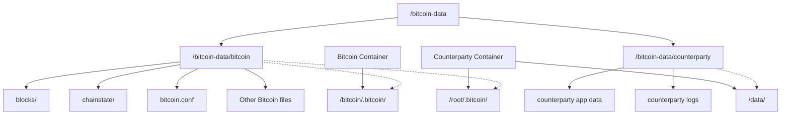

# Counterparty ARM64 Technical Reference

## Data Storage Architecture

This deployment uses a structured approach to data storage with clear separation between Bitcoin and Counterparty data.

### Directory Structure



### Volume Mappings

| Host Directory | Container Mount Point | Container | Purpose |
|----------------|----------------------|-----------|---------|
| `/bitcoin-data/bitcoin` | `/bitcoin/.bitcoin` | Bitcoin | Bitcoin blockchain and config |
| `/bitcoin-data/bitcoin` | `/root/.bitcoin` | Counterparty | Read-only access to Bitcoin data |
| `/bitcoin-data/counterparty` | `/data` | Counterparty | Counterparty application data |

### Configuration Details

#### Bitcoin Container
- **Data directory** explicitly set to `/bitcoin/.bitcoin` in two ways:
  1. In bitcoin.conf: `datadir=/bitcoin/.bitcoin`
  2. Command line parameter: `-datadir=/bitcoin/.bitcoin`
- **Configuration file** at `/bitcoin/.bitcoin/bitcoin.conf`
- **Blockchain data** stored in `/bitcoin/.bitcoin/blocks` and `/bitcoin/.bitcoin/chainstate`

#### Counterparty Container
- Accesses Bitcoin data at `/root/.bitcoin` (read-only)
- Stores its own data at `/data`
- Environment variables: `XDG_DATA_HOME=/data/`, `XDG_LOG_HOME=/data/`

### Command Line Access

When accessing Bitcoin through command line:

```bash
# Use the config file parameter
docker exec counterparty-node-bitcoind-1 bitcoin-cli -conf=/bitcoin/.bitcoin/bitcoin.conf getblockchaininfo
```

This clearly separated structure provides:
1. Better organization and clarity
2. Easier backups of individual components
3. Simplified debugging and maintenance
4. Clear boundaries between different applications

# Counterparty ARM64 Technical Reference

## Key Configuration Files

### Docker Compose Files
- **Main Docker Compose**: `/docker/docker-compose.yml`
  ```yaml
  # Service configuration structure
  x-bitcoind-common: &bitcoind-common
    image: bitcoind:arm64-local
    stop_grace_period: 1m
    volumes:
      - data:/bitcoin/.bitcoin
    restart: unless-stopped
    entrypoint: ["bitcoind"]

  x-counterparty-common: &counterparty-common
    image: counterparty/counterparty:local
    stop_grace_period: 1m
    volumes:
      - data:/root/.bitcoin
      - data:/data
    environment:
      - XDG_DATA_HOME=/data/
      - XDG_LOG_HOME=/data/
    restart: unless-stopped
  ```

- **Build Configuration**: `/docker/docker-compose.build.yml`
  ```yaml
  # Build configuration for Counterparty Core
  counterparty-core:
    build: 
      context: ${COUNTERPARTY_REPO:-/bitcoin-data/repo/counterparty-core}
      args:
        - BRANCH=${COUNTERPARTY_BRANCH:-master}
        - TAG=${COUNTERPARTY_TAG:-}
  ```

### Bitcoin Configuration
- **Dockerfile**: `/docker/Dockerfile.bitcoind`
- **Default Bitcoin Config**:
  ```
  rpcuser=rpc
  rpcpassword=rpc
  rpcallowip=0.0.0.0/0
  rpcbind=0.0.0.0
  server=1
  listen=1
  addresstype=legacy
  txindex=1
  prune=0
  dbcache=4000
  mempoolfullrbf=1
  ```

## Build and Deployment Scripts

### Setup Scripts
- **Main Setup**: `/scripts/setup.sh`
  ```bash
  # Run setup with options
  scripts/setup.sh --bitcoin-version 26.0 --counterparty-branch master --data-dir /bitcoin-data
  ```

### Start and Control Scripts
- **Start Service**: `/scripts/start-counterparty.sh`
  ```bash
  # Start with network profile
  ~/start-counterparty.sh mainnet
  ~/start-counterparty.sh testnet3
  ```

### AWS Deployment
- **CloudFormation Template**: `/aws/cloudformation/graviton-st1.yml`
- **Deploy Script**: `/aws/scripts/deploy.sh`
  ```bash
  # Create new stack
  ./aws/scripts/deploy.sh --stack-name my-counterparty-node
  
  # Update stack
  ./aws/scripts/deploy.sh --stack-name my-counterparty-node --update-stack
  
  # Update only Counterparty
  ./aws/scripts/deploy.sh --stack-name my-counterparty-node --update-counterparty-only
  ```

## Counterparty-Specific Configurations

### Network Profiles
- **Mainnet**:
  ```yaml
  counterparty-core:
    ports:
      - "4000:4000"  # API v2
      - "4100:4100"  # API v1
    command:
      - start
      - "--backend-connect=bitcoind"
      - "--rpc-host=0.0.0.0"
      - "--api-host=0.0.0.0"
      - "--catch-up=bootstrap"
  ```

- **Testnet**:
  ```yaml
  counterparty-core-testne3:
    ports:
      - "14000:14000"  # API v2
      - "14100:14100"  # API v1
    command:
      - start
      - "--testnet3"
      - "--backend-connect=bitcoind-testnet3"
      - "--rpc-host=0.0.0.0"
      - "--api-host=0.0.0.0"
      - "--catch-up=bootstrap"
  ```

### Default Credentials
- **RPC Credentials**:
  - Username: `rpc`
  - Password: `rpc`

## Common Commands and Patterns

### Check Status
```bash
# Check Bitcoin sync status
~/check-sync-status.sh

# Check disk usage
~/check-disk-usage.sh

# Check container status
docker ps
```

### Service Control
```bash
# Start with specific network
~/start-counterparty.sh mainnet
~/start-counterparty.sh testnet3
~/start-counterparty.sh testnet4
~/start-counterparty.sh regtest

# Build from source (for ARM64)
~/start-counterparty.sh mainnet true
```

### Maintenance
```bash
# Create snapshot backup
~/create-snapshot.sh

# Check logs
docker logs counterparty-core
docker logs bitcoind

# Reset containers
docker compose -f ~/counterparty-node/docker-compose.yml down
```

## Environmental Variables

```bash
# Data directory
COUNTERPARTY_DOCKER_DATA=/bitcoin-data

# Repository
COUNTERPARTY_REPO=/bitcoin-data/repo/counterparty-core

# Version control
COUNTERPARTY_BRANCH=master
COUNTERPARTY_TAG=v10.10.1
BITCOIN_VERSION=26.0

# Network profile
NETWORK_PROFILE=mainnet
```

## Docker Images
- **Bitcoin Core**: `xcparty/bitcoind-arm64:[version]`
- **Counterparty Core**: `xcparty/counterparty-core-arm64:[branch]`